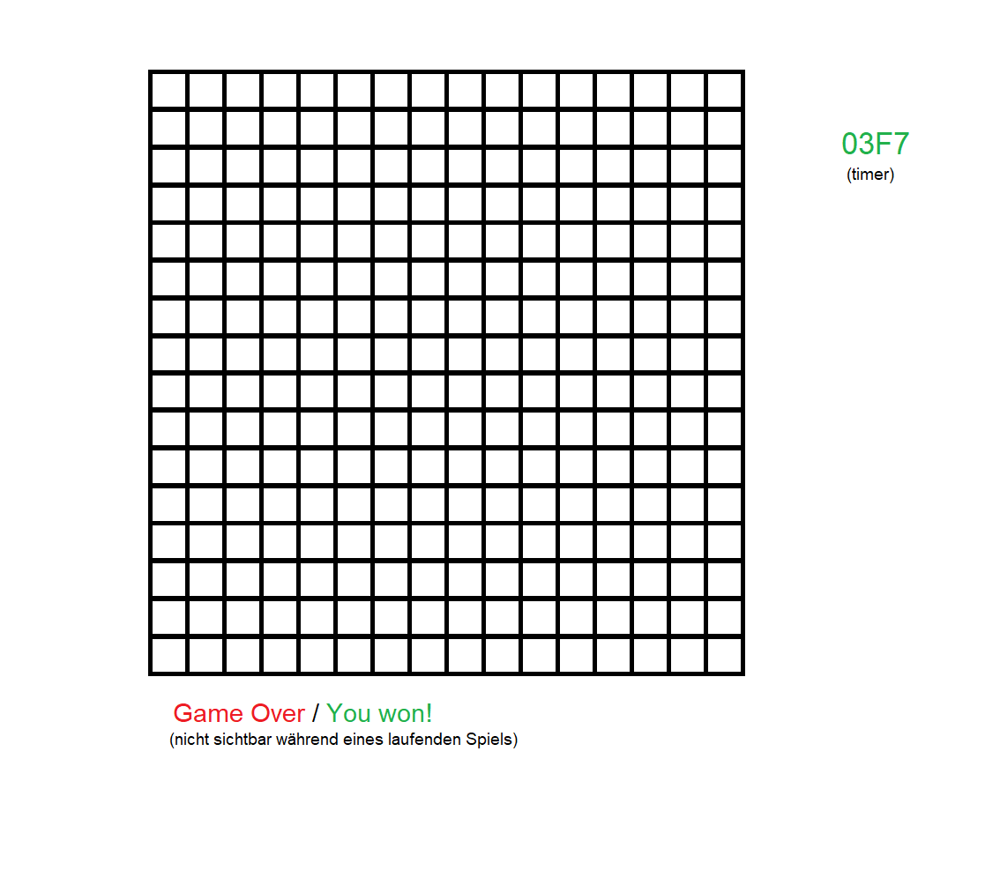

# Minesweeper in Assembly

## Bedienung
Die Bedienung erfolgt wie gewohnt. Mit Linksklick wird eine Kachel enthüllt (insofern diese nicht mit einer Flagge markiert ist). Enthüllt man eine Mine ist das Spiel zuende. Mit Rechtsklick kann man eine Flagge setzen oder entfernen. Mit Flaggen markierte Felder können nicht enthüllt werden.

Das Spiel endet sobald alle Nicht-Minen Felder aufegdeckt wurden. In dieser Version gibt es zusätzlich noch einen Timer, bei dessen Ablauf das Spiel ebenfalls endet.

Jede Zahl gibt an wie viele Minen sich in den umliegenden Feldern befinden.

## Skizze
